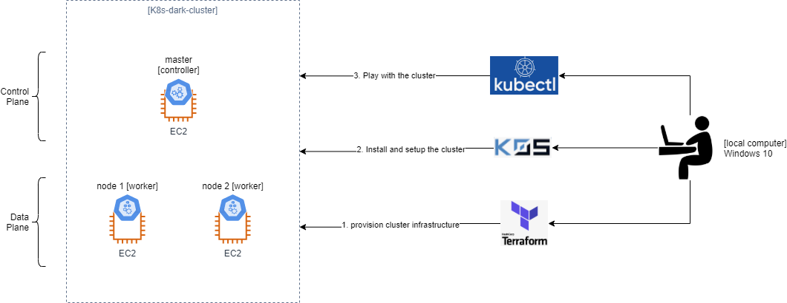

This Lab creates a kubernetes cluster on Amazon Web Services EC2  instances in order to play with it.

This lab uses:

1. [Terraform]() to provision the AWS infraestructure.
2. [k0sctl tool](https://docs.k0sproject.io/v1.22.5+k0s.1/k0sctl-install/). This is a command-line tool for bootstrapping and managing K0s clusters from local computer. 
    - [Here](https://github.com/k0sproject/k0sctl/releases) the repo and version used for Windows. 

3. The Kubernetes command-line tool, ```kubectl```, that allows you to play with the commands against Kubernetes cluster. 



# Prerequisites
1. An AWS account
2. A Key Pair created (in this case ```KeyPairForEC2TestingInstances.pem```)
3. Terraform installed in the local computer
4. Kubectl installed in the local computer.
5. K0s 
# Buid the infrastructure on AWS
Run the terraform script:

```terraform validate```

```terraform plan```

```terraform apply```

# Install the cluster from local computer with K0s
1. Download [k0sctl tool](https://docs.k0sproject.io/v1.22.5+k0s.1/k0sctl-install/) for Windows.
2. Run ```k0sctl-win-x64 init > k0sctl.yaml```
3. Run ```k0sctl-win-x64 apply --config k0sctl.yaml```
4. Customize the ```k0sctl.yaml``` file with the public IP's of the created EC2 instances (controller and workers).
    - Obtain the info from the outputs provided by terraform script.

# Set KUBECONFIG variable in Windows 10
1. Create ```kubeconfig``` file with command ```k0sctl-win-x64 kubeconfig > kubeconfig```
2. Copy ```kubeconfig``` file to ```.kube``` folder in path ```C:\Users\rafae\.kube```
3. Apply ```$env:KUBECONFIG = "C:\Users\rafae\.kube\kubeconfig"```
4. Run ```ls env:KUBECONFIG```

# Play with the cluster
- ```kubectl get nodes```
- ```kubectl cluster-info```
- ```kubectl describe node node-name```
- ```kubectl apply -f two-containers-in-one-pod.yaml```
- ```kubectl describe pod two-containers```
- ```kubectl exec -it two-containers -c nginx-container -- /bin/bash```

# Helpful sources
- [Setting up cluster with kubeconfig variable in windows](https://stackoverflow.com/questions/52449797/setting-up-clusters-and-work-nodes-how-do-i-set-kubeconfig-variable-in-windows)
- [Tutorial Kubernetes - Albert Coronado](https://www.youtube.com/watch?v=gmFSmzAWcig)
- [Deploy K0s in Linux](https://techviewleo.com/deploy-k0s-kubernetes-cluster-on-linux-using-k0sctl/)
- [Query Data with Outputs](https://learn.hashicorp.com/tutorials/terraform/aws-outputs)
- [Terraform how to do SSH into EC2](https://jhooq.com/terraform-ssh-into-aws-ec2/#4-generate-pem-file-from-aws-console-and-use-the-file-to-ssh-into-ec2)
[8 ways to create a Pod](https://www.cyberark.com/resources/threat-research-blog/eight-ways-to-create-a-pod)
[Communicate between Containers](https://kubernetes.io/docs/tasks/access-application-cluster/communicate-containers-same-pod-shared-volume/)