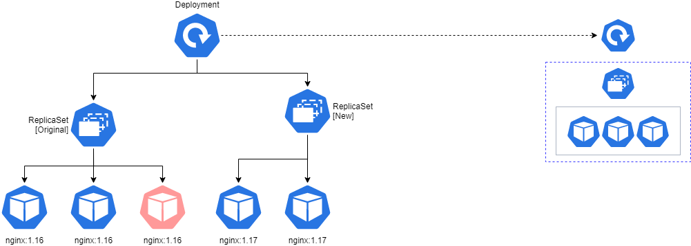

# Lab 02: Demo for update a container with ReplicaSet and Deployment Objects
This lab uses:
1. Cluster created in [Lab 01](../lab01_create_K8s_cluster/README.md)
2. The Kubernetes command-line tool, ```kubectl```
3. Visual Studio Code (Run as a Administrator)
4. Deployment Object File ```nginx-deployment-with-rolling.yaml``` [here](../lab02_replicaset_and_deployment_demo/nginx-deployment-with-rolling.yaml)

# Lab Architecture


# What is does
1. Implement a Deployment Object to play
2. Delete/Update some stuff
3. Update Container Image via Deployment Object
4. Delete the old ReplicaSet

# Commands used
- ```kubectl get all```
- ```kubectl get nodes```
- ```kubectl apply -f nginx-deployment-with-rolling.yaml```
- ```kubectl get all```
- Delete a pod (to see how replicaset works)
    - ```kubectl delete pod <pod-name>```
    - ```kubectl get all```
- Delete the Replicaset
    - ```kubectl get rs```
    - ```kubectl delete rs <rs-name>```
    - ```kubectl get rs``` (to show backup)
- Before update container image
    - ```kubectl describe pods``` (shows nginx:1.16 image)
    - ```kubectl describe rs```
    - ```kubectl get deployment```
    - ```kubectl describe deployment```
- Update container image to nginx 1.17 in file ```nginx-deployment-with-rolling.yaml```
    - ```kubectl apply -f nginx-deployment-with-rolling.yaml``` (this create two ReplicaSets)
    - ```kubectl get all```
    - ```kubectl get rs --watch```
    - ```kubectl get rs```
    - ```kubectl get pods``` (new ones)
    - ```kubectl describe pods``` (shows nginx:1.17 updated image)
- Delete ReplicaSet with no Pods
    - ```kubectl get rs```
    - ```kubectl delete rs <rs-name>```
    - ```kubectl get rs```
- Delete Deployment
    - ```kubectl get deploy -A```
    - ```kubectl delete deploy <deploy-name> -n <namespace>```
