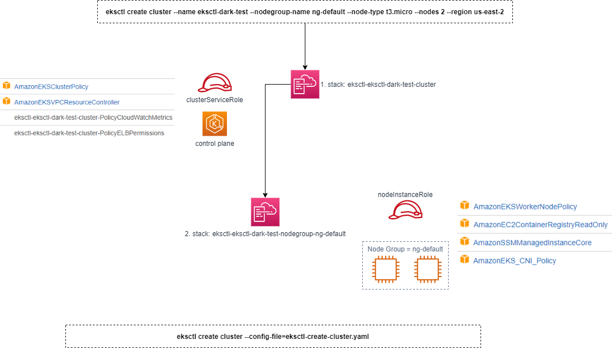

# Lab 05: Demo for create an EKS cluster
This lab uses:
1. AWS EKS and AWS Console
2. The ```eksctl``` command-line tool 
3. Visual Studio Code (Run as a Administrator)

# Lab Diagram


# What is does
1. Create a cluster with ```eksctl``` 
2. Alternative: Create a cluster with  ```eksctl``` with a yaml config [file](../lab05_create_cluster_with_eksctl/eksctl-create-cluster.yaml)
3. Play with the cluster and review resources created in AWS Console
4. Add two node groups to the cluster
4. Delete the cluster

# Commands used
- ```eksctl create cluster --name eksctl-dark-test --nodegroup-name ng-default --node-type t3.micro --nodes 2 --region us-east-2```
- Alternative: ```eksctl create cluster --config-file=eksctl-create-cluster.yaml```
- ```eksctl create nodegroup --config-file=eksctl-create-ng.yaml```
- ```eksctl get nodegroup --cluster=eksctl-dark-test```
- ```kubectl get nodes```
- Delete the cluster
    - ```eksctl get cluster```
    - ```eksctl delete cluster --name=eksctl-dark-test```
    - ```eksctl get cluster```
- Other commands
    - ```eksctl utils describe-stacks --region=us-east-2 --cluster=eksctl-dark-test```
    - ```eksctl utils update-cluster-logging --enable-types={SPECIFY-YOUR-LOG-TYPES-HERE (e.g. all)} --region=us-east-2 --cluster=eksctl-dark-test'```
